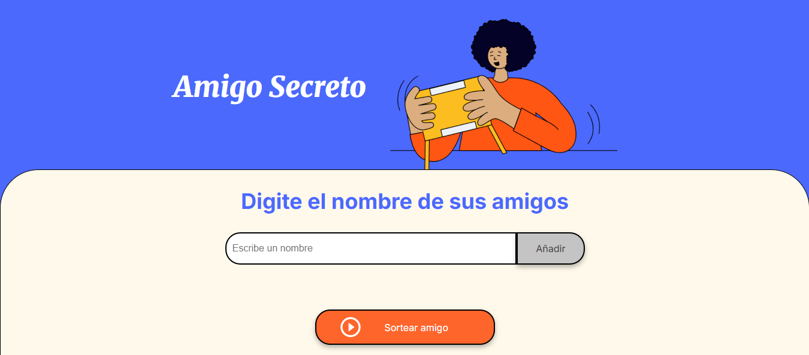
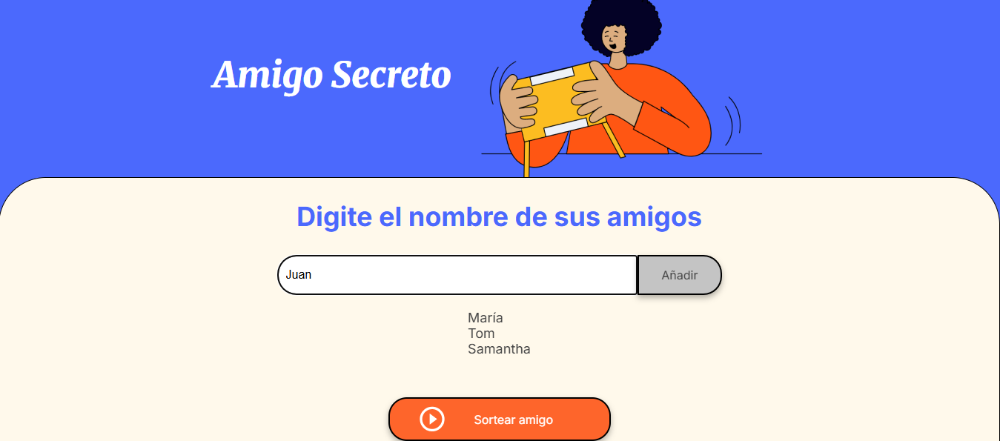
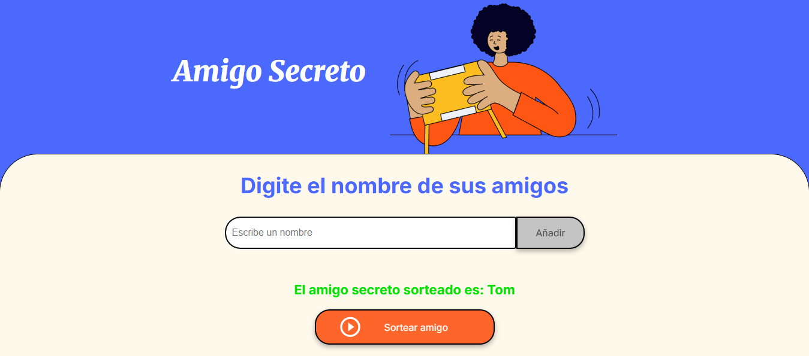

# 🎁 Challenge Amigo Secreto

Una aplicación web simple y funcional que permite cargar una lista de amigos y sortear al azar un **amigo secreto**.

---

## 🧩 Características

-   ✅ Agregar nombres de amigos dinámicamente
-   ✅ Mostrar en pantalla la lista ingresada
-   ✅ Sortear un nombre aleatorio de la lista
-   ✅ Interfaz amigable y visual

---

## 🛠️ Tecnologías utilizadas

-   HTML5
-   JavaScript puro (vanilla)
-   CSS3

---

## 🚀 Cómo usarla

1. Abrí el archivo `index.html` en tu navegador.

2. Escribí los nombres de tus amigos en el campo de entrada.

3. Hacé clic en **"Añadir"** para agregarlos a la lista.
4. Cuando estén todos los participantes, hacé clic en **"Sortear amigo"**.

5. El sistema elegirá uno al azar y lo mostrará en pantalla.
